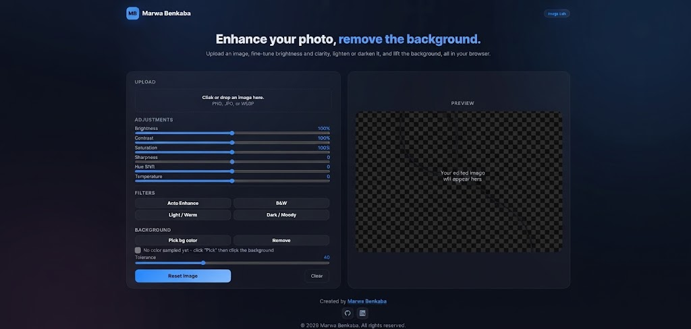
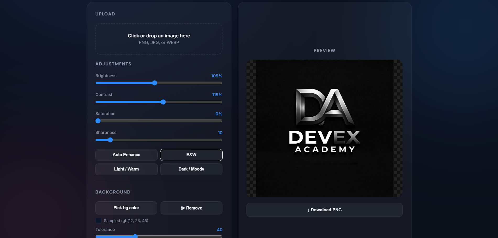
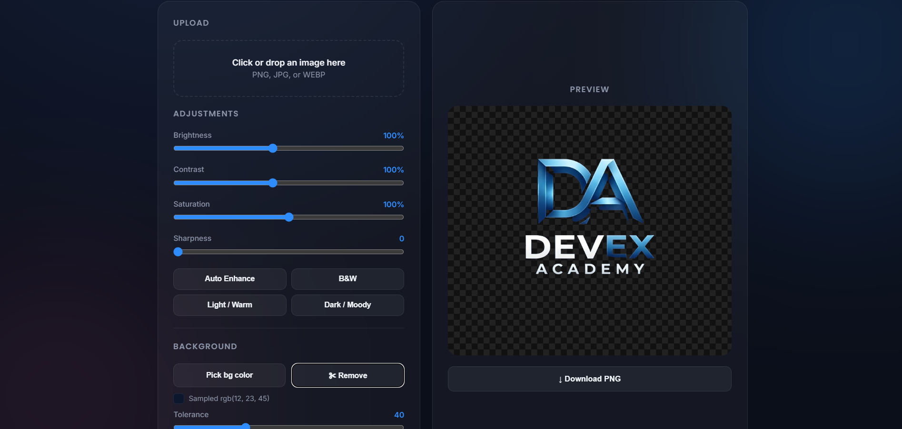

# Devex | Image Studio

A modern, browser-based **image enhancement and background removal tool** built with HTML, CSS, JavaScript, and the HTML5 Canvas API.

Devex Image Studio allows users to upload an image, enhance its appearance, adjust colors and sharpness, remove backgrounds by sampling a color, and download the edited result as a PNG file.

## ✨ Features

### 📤 Image Upload

Upload images directly from your computer using:

- File selection
- Drag & drop

Supported image types:

- PNG
- JPG / JPEG
- WEBP

The uploaded image is processed directly in the browser.

### 🎨 Image Adjustments

Fine-tune your image using interactive controls:

- **Brightness**
- **Contrast**
- **Saturation**
- **Sharpness**

Changes are rendered directly onto an HTML5 Canvas.

### ⚡ Presets

Quickly apply predefined editing styles:

- **Auto Enhance**
- **B&W**
- **Light / Warm**
- **Dark / Moody**

Each preset automatically adjusts brightness, contrast, saturation, and sharpness.

### ✂️ Background Removal

Remove a background using color sampling:

1. Upload an image.
2. Click **Pick bg color**.
3. Click the background color directly on the image.
4. Adjust the **Tolerance** value.
5. Click **Remove**.

Pixels whose color is sufficiently close to the sampled color are made transparent.

### 🔍 Color Sampling

The application includes an interactive color picker that allows users to select a pixel directly from the image.

The selected RGB color is displayed before background removal.

### 💾 Download

Edited images can be downloaded as:

```text
edited-image.png
```

The application generates the PNG directly from the HTML5 Canvas.

### 🔄 Reset & Clear

**Reset Image**

Restores the image adjustments to their default values.

**Clear**

Removes the current image and resets the workspace.

## 🛠️ Technologies Used

| Technology | Purpose |
|---|---|
| **HTML5** | Application structure |
| **CSS3** | UI design and responsive layout |
| **JavaScript** | Application logic |
| **HTML5 Canvas** | Image rendering and processing |
| **FileReader API** | Reading uploaded images |
| **Canvas ImageData API** | Pixel-level image manipulation |

No backend or external image-processing server is required.

## 📁 Project Structure

```text
devex-image-studio/
│
├── index.html
└── README.md
```

The application is implemented as a single HTML file containing the HTML structure, CSS styling, and JavaScript functionality.

## 🚀 Getting Started

### 1. Clone the repository

```bash
git clone https://github.com/USERNAME/devex-image-studio.git
```

Replace `USERNAME` with your GitHub username.

### 2. Navigate to the project

```bash
cd devex-image-studio
```

### 3. Run the application

Simply open:

```text
index.html
```

in your browser.

You can also use **VS Code Live Server** for local development.

## 🖥️ How to Use

### 1. Upload an Image

Click the upload area or drag an image into it.

```text
Click or drop an image here
PNG, JPG, or WEBP
```

### 2. Enhance the Image

Use the adjustment sliders to modify:

```text
Brightness
Contrast
Saturation
Sharpness
```

### 3. Apply a Preset

Choose one of the predefined presets:

```text
Auto Enhance
B&W
Light / Warm
Dark / Moody
```

### 4. Remove the Background

Click:

```text
Pick bg color
```

Then select the background directly from the image.

Adjust the tolerance if necessary and click:

```text
Remove
```

### 5. Download

Click:

```text
↓ Download PNG
```

to save the edited image.

## 🎨 Design

Devex Image Studio uses a modern dark interface with a blue and pink visual identity.

Main design colors include:

```text
Background:      #0b0f1a
Primary Blue:    #2f8cff
Pink Accent:     #ff5da2
Text:            #eef1f7
Muted Text:      #8b93a7
```

The application uses **Poppins** and **Inter** fonts and includes a responsive layout that changes to a single-column interface on smaller screens.

## 🧠 How Background Removal Works

The background-removal feature uses a simple **color-distance algorithm**.

After the user selects a background color, the application compares every pixel against the sampled RGB color.

Pixels whose color distance is below the selected tolerance are assigned an alpha value of `0`, making them transparent.

This approach works particularly well when the subject and background have clearly different colors.

## 🔒 Privacy

Image processing is performed directly in the browser using JavaScript and Canvas.

The project does not implement a backend image-upload service.

## 📸 Screenshots

Add screenshots of the application here:

```markdown





```

## 👨‍💻 Developer

**Marwa Benkaba**

- GitHub: https://github.com/BenkabaMarwa
- LinkedIn: https://www.linkedin.com/in/marwa-benkaba-916090329/

## 📄 License

Add your preferred license before publishing the repository.

---

© 2026 Marwa Benkaba. All rights reserved.
